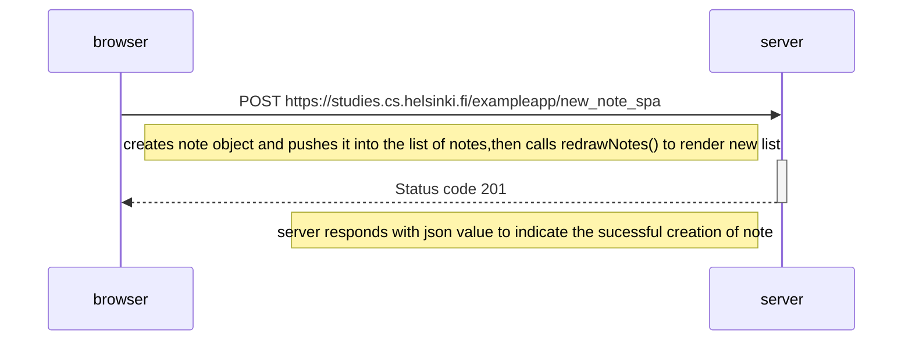

```mermaid


sequenceDiagram
    participant browser
    participant server


    browser->>server: POST https://studies.cs.helsinki.fi/exampleapp/new_note_spa
    Note right of browser:creates note object and pushes it into the list of notes,then calls redrawNotes() to render new list

    activate server
    server-->>browser: Status code 201
    deactivate server

    Note left of server: server responds with json value to indicate the sucessful creation of note


```
